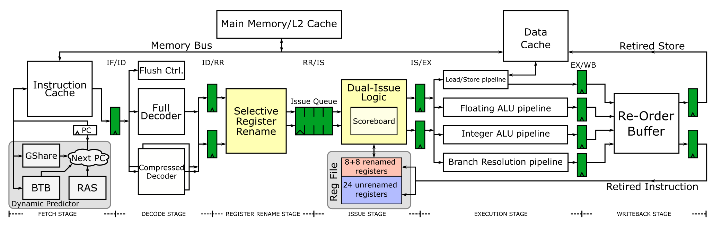

# DRiM - DUTH RISC-V Microprocessor
Low-cost 6-stage pipeline of an 32-bit RISC-V processor allowing the dual-issuing of only 16-bit compressed instructions. DRiM can substantially improve instruction throughput and reduce execution times. Additionally, the new processor employs selective register renaming to specifically target the registers used under instruction compression, thereby completely eliminating unnecessary stalls due to name dependencies. Finally, the new design utilizes a partitioned register file that capitalizes on the skewed use of registers to improve energy efficiency through clock gating. The main features of DRiM are summarized :

- Support for “RV32I” Base Integer Instruction Set, “M” Standard Extension for Integer Multiplication and Division and “C” Standard Extension for Compressed Instructions
- Single fetch for 32-bit instructions and Dual Fetch & Dual Issue for Compressed instructions
- Selective Register Renaming Scheme
- Dynamic Branch Prediction
- OoO Execution
- Non-blocking data cache

|  |
|:--:|
| *Overview of the pipeline of DRiM* |

### Directory Hierarchy

- `rtl` : contains all the synthesisable RTL files
- `sim` : contains the provided testbench and example codes with detailed instructions on how to compile and run your code
- `sva`: contains related x-checks and assertions for the design. SVAs have been used only during simulation and not in any formal verification process
- `images` : schematics

### Future Work
- Partially implemented: Decode for additional instructions that are not yet supported (System, floating point, CSR) and exception detection
- Replace MUL/DIV units with optimised hardware, to reduce execution latency and decompress a lot of the paths
- Exception detection and Interrupt handling
- Virtual Memory
- 64bit support
- Align to future versions of the RISC-V ISA. Current document version supported is *20191213* of the Unpriviledged ISA manual

## How to Compile and Simulate
Instructions for generating your own executable file and converting it to a memory file suitable for the CPU can be found in directory `sim`. Examples (code and precompiled files) are included in the `/sim/examples` directory.


## Reference

The architecture and performance is presented in Microprocessors and Microsystems, Elsevier, Sept., 2018.  You can find the [paper](https://gdimitrak.github.io/papers/micropro18.pdf) here. To cite this work please use
```
@article{PATSIDIS20181,
author = {K. {Patsidis} and D. {Konstantinou} and C. {Nicopoulos} and G. {Dimitrakopoulos}},
title = {A low-cost synthesizable RISC-V dual-issue processor core leveraging the compressed Instruction Set Extension},
journal = {Microprocessors and Microsystems},
volume = {61},
pages = {1-10},
year = {2018},
issn = {0141-9331},
doi = {https://doi.org/10.1016/j.micpro.2018.05.007},
url = {https://www.sciencedirect.com/science/article/pii/S0141933118300048} }
```


## License
This project is licensed under the [MIT License](./LICENSE).
